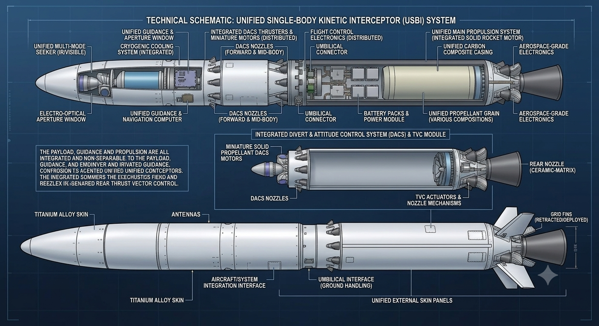

# 🛰️ Airborne Defense Command Center (Digital Twin & SIL Simulation)

<div align="center">
  
</div>

An executive-level **Software-In-The-Loop (SIL) simulation dashboard** for an air-launched 1.8m single-body kinetic interceptor operating in low-density, high-altitude atmospheric conditions.

---

## 🎯 Key Engineering Architecture
- **1.8m Single-Body Composite Casing:** Carbon-composite structural hull engineered to withstand $>30g$ lateral divert thrust without staging latency.
- **Low-Density Altitude Maneuverability:** Integrates a forward-ring **Mini-DACS (Divert & Attitude Control System)** utilizing cold/solid gas micro-thrusters to achieve instant $90^\circ$ turns where aerodynamic fins fail due to thin atmosphere.
- **Ka-Band MMW Radar Seeker:** High-frequency millimeter-wave target acquisition resistant to aerothermal optical blinding and ECM jamming.
- **Cinematic Auto-Patrol Radar Scope:** Real-time HTML5 Canvas tracking platform movement, threat vector homing, and interceptor ejection.

---

## 🏗️ Command Center Dashboard Layout

| Panel | Core Functionality |
| :--- | :--- |
| **Left Panel** | **Interactive Subsystem Blueprint:** Cutaway schematic with active hotspots (Seeker, Mini-DACS, AI Core, Motor) and dynamic material telemetry. |
| **Center Panel** | **Tactical Radar Scope:** Auto-patrol flight trajectory of `VIPER-01`, slow-motion threat homing, interceptor ejection, and ECM static jamming effects. |
| **Right Panel** | **Live Telemetry Stream:** Dynamic Mach velocity, distance-to-target tracking, and real-time Threat Assessment Gauge. |
| **Footer** | **Terminal Log:** Sequential event stream tracking system states in real time. |

---

## 🚀 Run Locally

### Prerequisites
- **Node.js** (v18 or higher)

### Setup Steps
1. **Install dependencies:**
   ```bash
   npm install
