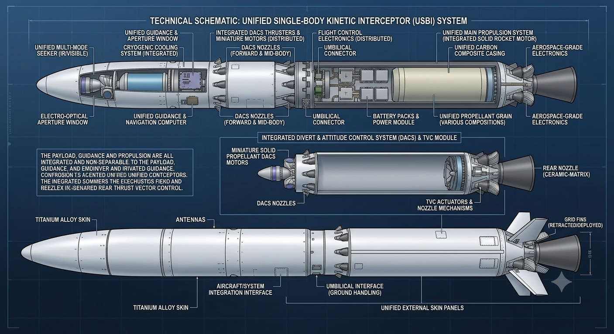

# AI-Based Airborne Threat Interception & Predictive Tracking Simulator
## Software-In-The-Loop (SIL) Digital Twin Dashboard for High-Altitude Airborne Kinetic Interceptor System

<div align="center">
  
</div>

---

## 🔬 Technical Subsystem Breakdown (USBI Architecture)

The **Unified Single-Body Kinetic Interceptor (USBI)** system integrates payload, guidance, and propulsion into a non-separable carbon-composite fuselage to eliminate multi-stage separation latency and maximize thrust-to-weight efficiency.

```
+-------------------------------------------------------------------------------------------------+
|                                 USBI COMPONENT LAYOUT MAP                                       |
+-------------------+--------------------+------------------------+-------------------------------+
| NOSE SECTION      | CONTROL SECTION    | AVIONICS & POWER       | PROPULSION & TAIL             |
| - Multi-Mode      | - Forward DACS     | - Guidance Computer    | - Solid Rocket Engine         |
|   Seeker (MMW/IR) |   Nozzle Ring      | - Distributed Avionics | - Ceramic Nozzle & TVC        |
| - Electro-Optical | - Miniature Solid  | - High-Density Power   | - Carbon Composite Casing     |
|   Aperture Window |   Motors           |   Module               | - Deployable Grid Fins        |
+-------------------+--------------------+------------------------+-------------------------------+
```

### 1. Seeker & Sensor Package (Nose Section)
* **Unified Multi-Mode Seeker (IR/Visible/Ka-Band MMW):** Combines radio-frequency millimeter-wave (35GHz Ka-Band monopulse AESA) radar with electro-optical/infrared tracking for all-weather, high-jamming resistance during terminal homing.
* **Silicon Nitride (Si3N4) Ceramic Radome:** Heat-resistant quartz/sapphire aperture designed to withstand extreme aerothermal friction (1,400°C shock) during high-Mach ascent (Mach 4.5+).
* **Integrated Cryogenic Cooling System:** Rapidly cools infrared focal plane arrays to prevent thermal blinding from high-altitude atmospheric skin friction.

### 2. Divert & Attitude Control System (DACS)
* **Forward & Mid-Body DACS Nozzles:** A distributed ring of 8 high-response lateral thruster nozzles that deliver instantaneous side-force pulses ($>30g$).
* **Miniature Solid Propellant DACS Motors:** Provides direct thrust vectoring in low-density, high-altitude air (20–45 km) where aerodynamic control surfaces produce insufficient dynamic pressure ($q$).

### 3. Guidance, Avionics & Power Core
* **Unified Guidance & Navigation Computer:** Radiation-hardened FPGA/SoC executing real-time Kalman filtering and high-speed intercept trajectory computation (1,200 Hz loop).
* **Distributed Aerospace-Grade Electronics:** Shock-mounted avionics modules positioned along the central spine with Beryllium-Copper suspension to balance mass distribution under 45g shocks.
* **High-Density Power Module:** High-discharge Lithium-Polymer energy module providing stable voltage (28.4V) during extreme lateral g-force pulses.

### 4. Propulsion & Airframe (Tail Section)
* **Filament-Wound Toray T1100 Carbon-Fiber Casing:** Cyanate ester matrix rated for 30g sustained lateral acceleration and aerodynamic shearing.
* **Dual-Thrust Solid Rocket Motor:** Hydroxyl-terminated Polybutadiene (HTPB) grain delivering 18.4 kN boost thrust and 4.2 kN sustain thrust.
* **Deployable Grid Fins:** Four planar titanium lattice grid fins with ±38° slew angle for supersonic stability.

---


## 1. Project Objective

The objective of this project is to develop a safe, non-weaponized, digital simulation of an airborne defensive interception system. The application demonstrates real-time radar observation, stochastic target tracking (Kalman Filtering), machine learning-based trajectory extrapolation (Scikit-Learn Polynomial Regression), and geometric meeting-point calculation to deploy a virtual defensive interceptor toward an incoming airborne threat.

---

## 2. Problem Statement

Airborne threats present substantial challenges to defensive awareness systems due to:
1. **Sensor Measurement Noise:** Radar echoes are corrupted by atmospheric attenuation, electronic interference, and Gaussian spatial jitter.
2. **Kinematic Non-Linearity:** Airborne objects can undergo curved trajectories, gradual vector drifts, or high-G evasive maneuvers.
3. **Time-Critical Decision Making:** Human operators cannot manually calculate interception rendezvous vectors against high-speed incoming threats within tight defensive windows.

A system is needed to ingest noisy observations, estimate true kinematics, predict future spatial trajectories using AI, and calculate the optimal interception point in real time.

---

## 3. Proposed Solution

This simulator provides an end-to-end, multi-tier software pipeline:
- **Synthetic Sensor Engine:** Ingests ground-truth flight kinematics and applies controllable Gaussian noise to model realistic radar observations.
- **Recursive Discrete Kalman Filter:** State estimator with a 4-dimensional state vector $[x, y, v_x, v_y]^T$ that continuously updates target position, velocity, and tracking confidence while rejecting sensor noise.
- **AI Trajectory Predictor:** Online Scikit-Learn Polynomial Ridge Regression model fitting recent observation history and forecasting the next 3.5 seconds of spatial flight path.
- **Geometric Meeting-Point Calculator:** Evaluates space-time convergence between predicted threat positions and interceptor speed capabilities to establish a rendezvous point.
- **Virtual Interceptor Guidance:** Proportional pursuit model animating a virtual defender toward the rendezvous point.
- **Tactical Defense Dashboard:** Dual-tier interface with 60 FPS HTML5 Canvas Radar HUD, live Recharts telemetry charts, chronological mission event log, and educational pipeline inspection pages.

---

## 4. System Architecture

```
+-----------------------------------------------------------------------------------+
|                            SIMULATED SENSOR GENERATOR                             |
|          [Generates Ground-Truth Kinematics (x, y) + Gaussian Noise N(0, σ²)]     |
+------------------------------------------+----------------------------------------+
                                           | Raw Echo Stream
                                           v
+-----------------------------------------------------------------------------------+
|                          DATA ACQUISITION & INGESTION                             |
|                   [Time-step Quantization (dt = 0.1s), Validation]                |
+------------------------------------------+----------------------------------------+
                                           | Validated Observations [z_k]
                                           v
+-----------------------------------------------------------------------------------+
|                        OBJECT DETECTION & TRACK INITIATION                        |
|                  [M-of-N Spatial Window Gate, Initial Covariance P_0]             |
+------------------------------------------+----------------------------------------+
                                           | Track Stream
                                           v
+-----------------------------------------------------------------------------------+
|                     TARGET TRACKING (DISCRETE KALMAN FILTER)                      |
|           [State: [x, y, vx, vy]^T | Predict -> Innovation -> Kalman Gain -> Update] |
+------------------------------------------+----------------------------------------+
                                           | Filtered State Vector + Confidence %
                                           v
+-----------------------------------------------------------------------------------+
|                       AI / ML TRAJECTORY PREDICTOR                                |
|        [Polynomial Ridge Regression (degree=2) over rolling window of N samples]  |
+------------------------------------------+----------------------------------------+
                                           | Projected Future Trajectory Points
                                           v
+-----------------------------------------------------------------------------------+
|                      INTERCEPTION-POINT ESTIMATION                                |
|      [Kinematic Convergence Solver: dist(Origin, Target_i) / V_int <= (t_i - t)]   |
+------------------------------------------+----------------------------------------+
                                           | Predicted Meeting Point (x*, y*, TTI)
                                           v
+-----------------------------------------------------------------------------------+
|                      VIRTUAL INTERCEPTOR SIMULATION                               |
|              [STANDBY -> DEPLOYED -> Vector Pursuit -> Interception Success]      |
+------------------------------------------+----------------------------------------+
                                           | Real-Time Mission Telemetry
                                           v
+-----------------------------------------------------------------------------------+
|                       VISUALIZATION & TELEMETRY DASHBOARD                         |
|   [2D Tactical Radar Canvas | Telemetry Gauges | Recharts Curves | Event Log]     |
+-----------------------------------------------------------------------------------+
```

---

## 5. Technology Stack

### Frontend
- **React 18 & TypeScript:** High-performance single-page architecture.
- **Tailwind CSS:** Professional dark-mode military/research aesthetics (HUD glassmorphism, glowing telemetry badges, crisp mono typography).
- **HTML5 Canvas API:** Custom 2D radar HUD with rotating sweep beam, range rings, azimuth degrees, and interactive trajectory layers.
- **Recharts:** High-precision telemetry charting for observed vs. filtered vs. predicted positions and real-time tracking error.
- **Lucide Icons:** Tactical iconography.

### Backend
- **Python 3.10+ with FastAPI:** RESTful simulation service.
- **NumPy:** Matrix linear algebra for Kalman filter covariance updates and state propagation.
- **Scikit-Learn:** Polynomial feature transformation and Ridge regression for trajectory curve fitting.
- **Uvicorn:** High-throughput ASGI web server.

### Dual-Mode Architecture (Resilience Feature)
The application includes a dual-engine design:
1. **Full-Stack Mode:** Connects to the Python FastAPI backend for server-side processing.
2. **Client-Engine Fallback:** If the Python backend is offline or disconnected, an equivalent in-browser TypeScript simulation engine takes over automatically with zero dropped frames or UI interruption.

---

## 6. Mathematical & AI/ML Methodology

### A. Target Tracking (Discrete Linear Kalman Filter)
The target state is modeled as:
$$\mathbf{x}_k = \begin{bmatrix} x_k \\ y_k \\ \dot{x}_k \\ \dot{y}_k \end{bmatrix}$$

- **State Transition Matrix ($\mathbf{F}$):**
  $$\mathbf{F} = \begin{bmatrix} 1 & 0 & \Delta t & 0 \\ 0 & 1 & 0 & \Delta t \\ 0 & 0 & 1 & 0 \\ 0 & 0 & 0 & 1 \end{bmatrix}$$

- **Measurement Matrix ($\mathbf{H}$):**
  $$\mathbf{H} = \begin{bmatrix} 1 & 0 & 0 & 0 \\ 0 & 1 & 0 & 0 \end{bmatrix}$$

- **Cycle Steps:**
  1. **Predict:**
     $$\hat{\mathbf{x}}_{k|k-1} = \mathbf{F} \hat{\mathbf{x}}_{k-1|k-1}$$
     $$\mathbf{P}_{k|k-1} = \mathbf{F} \mathbf{P}_{k-1|k-1} \mathbf{F}^T + \mathbf{Q}$$
  2. **Measurement Residual (Innovation):**
     $$\tilde{\mathbf{y}}_k = \mathbf{z}_k - \mathbf{H} \hat{\mathbf{x}}_{k|k-1}$$
  3. **Kalman Gain:**
     $$\mathbf{S}_k = \mathbf{H} \mathbf{P}_{k|k-1} \mathbf{H}^T + \mathbf{R}$$
     $$\mathbf{K}_k = \mathbf{P}_{k|k-1} \mathbf{H}^T \mathbf{S}_k^{-1}$$
  4. **Correct:**
     $$\hat{\mathbf{x}}_{k|k} = \hat{\mathbf{x}}_{k|k-1} + \mathbf{K}_k \tilde{\mathbf{y}}_k$$
     $$\mathbf{P}_{k|k} = (\mathbf{I} - \mathbf{K}_k \mathbf{H}) \mathbf{P}_{k|k-1}$$

### B. AI Trajectory Prediction Model
A rolling buffer of $N$ recent filtered states is ingested. A degree-2 polynomial model with $L_2$ regularization is fitted:
$$x(t) = a_x t^2 + b_x t + c_x$$
$$y(t) = a_y t^2 + b_y t + c_y$$

$$\mathcal{L}(\mathbf{w}) = \|\mathbf{y}_{obs} - \mathbf{X}_{poly} \mathbf{w}\|_2^2 + \alpha \|\mathbf{w}\|_2^2$$

The trained model extrapolates the next $K$ future time slices ($t_{now} + i \cdot \Delta t$), producing the dashed cyan trajectory on the radar scope.

### C. Geometric Interception-Point Solver
Given interceptor initial location $\mathbf{p}_{int}$, cruising speed $V_{int}$, and predicted threat points $\{\mathbf{p}_i, t_i\}$:
$$\frac{\|\mathbf{p}_i - \mathbf{p}_{int}\|}{V_{int}} \le t_i - t_{current}$$
The algorithm selects the earliest future index $i^*$ satisfying this inequality as the **Predicted Interception Point**.

---

## 7. Scenarios Supported

| Scenario | Name | Trajectory Dynamics | Sensor Noise | Purpose |
|---|---|---|---|---|
| **Scenario 1** | Straight Path | Constant linear velocity vector | Low ($0.8\sigma$) | Baseline convergence test |
| **Scenario 2** | Variable Path | Harmonic sinusoidal curvature | Medium ($1.2\sigma$) | Tests polynomial curve prediction |
| **Scenario 3** | Noisy Sensor | Smooth flight + heavy Gaussian jitter | High ($2.6\sigma$) | Demonstrates Kalman noise rejection |
| **Scenario 4** | High-G Maneuver | Discrete evasive direction shifts | Variable ($1.5\sigma$) | Tests real-time re-prediction & retargeting |

---

## 8. Installation & Setup Instructions

### Prerequisites
- **Node.js**: v18.0.0 or higher
- **Python**: 3.10, 3.11, 3.12, 3.13, or 3.14

### Step 1: Start the Python FastAPI Backend
Open a terminal in the project root:
```powershell
# Navigate to backend and install requirements
python -m pip install -r backend/requirements.txt

# Start FastAPI server on port 8000
python -m uvicorn backend.main:app --host 127.0.0.1 --port 8000 --reload
```
The backend will launch at `http://127.0.0.1:8000`. You can verify API docs at `http://127.0.0.1:8000/docs`.

### Step 2: Start the React Frontend
Open a second terminal in the project root:
```powershell
cd frontend
npm.cmd install --legacy-peer-deps
npm.cmd run dev
```
Open your browser at `http://localhost:5173`.

---

## 9. Presentation Guide ("How to Pitch to Judges")

When presenting at a college symposium or hackathon (SIH), state:

> *"Good morning, judges. Our project is an **AI-Based Airborne Threat Interception & Predictive Tracking Simulator**.  
> In modern defense labs, raw radar data arrives with significant noise and uncertainty.  
> As you can see on our 2D radar interface, the red diamond represents an incoming threat object. The yellow point cloud demonstrates the noisy sensor readings our radar receives.  
> Our system feeds these noisy readings into a Discrete Linear Kalman Filter, which isolates the signal to compute the true position and velocity, shown by the solid green track.  
> Next, our machine learning model uses polynomial ridge regression to analyze the target's recent kinematic history and predict its future 3.5-second flight path, visualized as this cyan dashed line.  
> From that predicted path, the system calculates the optimal future meeting point in space-time and deploys a virtual defensive interceptor from our fighter defense station.  
> As the interceptor closes in on the meeting point, the telemetry dashboard tracks tracking confidence, prediction RMSE, velocity, and time-to-intercept, concluding in a successful simulation interception."*

Click **"Run Demo"** in the top bar to trigger the automated 30-second sequence.

---

## 10. Important Safety & Ethical Boundaries

This software is strictly an **educational simulation and academic research prototype**.
- **No Weaponized Logic:** Does not model real missile guidance, proportional navigation gains, seeker hardware, or physical propulsion.
- **No Explosives or Warheads:** The interception event is an abstract geometric point encounter between two virtual entities.
- **Normalized Units:** All velocities, coordinates, and distances are normalized simulation values.
- **No Real-World Targeting:** Contains no real-world weapon parameters, classified military data, or blueprints for physical device construction.

---

## 11. Limitations & Future Scope

### Current Limitations
- 2D Cartesian spatial representation (Z-altitude axis omitted for standard laptop performance).
- Deterministic aerodynamic drag and environmental wind shear are abstracted.

### Future Scope
- Extension to 3D spherical coordinate radar environments using WebGL/Three.js.
- Multi-target simultaneous tracking using Joint Probabilistic Data Association (JPDA).
- Long Short-Term Memory (LSTM) / Transformer neural networks for trajectory prediction against intentional deceptive maneuvers.
